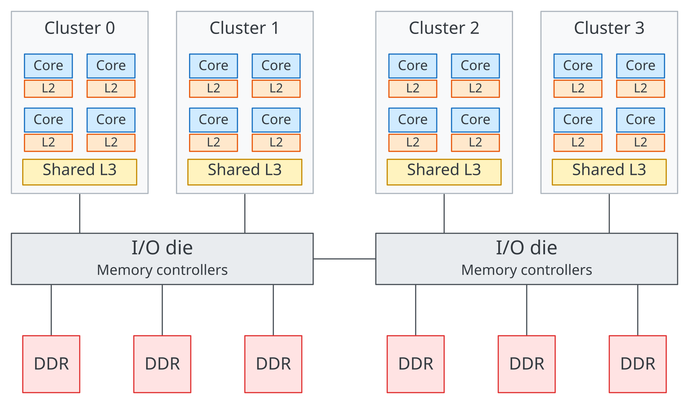

## Key takeaways

L3 caches on many high performance CPUs are distributed in slices across the CPU die, with coherence agents coordinating requests. The interconnect carries requests, cache line data, and coherence messages between cores and caches. The placement of those components and the paths between them can result in nonuniform cache access latency.

## Introduction

I've been interested in how CPUs are constructed, especially at the interconnect level. Through reading many a technical document and conference slide, I've accumulated some knowledge that has helped with my work this summer developing microbenchmarks for caches and interconnect behavior.

This article is a short introduction to caches and interconnects in modern processors. It assumes elementary knowledge of computer architecture. There will be a follow up article explaining the behavior of atomic transactions between cores, leading up to an article on microbenchmarking core to core latency.

If you have feedback, please let me know - I am constantly learning and would love to discuss!

## Cache Organization

Caches are the fastest and smallest tiers of the memory subsystem. Their purpose is to keep frequently used data close to the CPU, avoiding slower accesses to DRAM or storage.

The memory hierarchy can be broadly described as:

Disk -\> Memory -\> Cache

in ascending order of speed and descending order of size.

Modern CPUs have multiple cache levels, from L1 to L2 to L3, and sometimes a system level cache.

Caches store data in fixed size cache lines, commonly 64 bytes, which are the units tracked by the cache. These lines are organized into sets and ways, and larger caches may also be physically divided into smaller banks or slices.

L1 caches are often split into instruction and data caches and are generally private, meaning each CPU core has its own distinct block of L1 cache. On many modern high performance CPUs, L2 caches are private as well, though some implementations share an L2 cache across a cluster of cores. L3 caches are generally shared amongst multiple CPU cores, allowing them to access data in the shared last level cache without going all the way out to DRAM.

{.cache-layout-diagram fig-alt="Four core clusters with blue cores, orange private L2 caches and yellow shared L3 caches, connected through two I/O dies to DDR memory."}

On CPUs with a private L2, the core often connects to the rest of the system through its L2 controller and coherence interface. From the POV of the interconnect, that interface sends memory requests and responds to coherence messages.

## Distributing Cache {#distributing-the-last-level-cache}

For the next example, assume we have a hypothetical 16 core CPU with 16 MiB of shared L3 cache. We will use this as a simple example to illustrate how the cache might be organized and how requests move through the processor.

To implement this, you might think to stick one big block of cache in the middle of the CPU and connect all the cores to it. But as the number of cores grows, this creates challenges for achieving suitable latency and bandwidth. If many cores want to access the L3 at the same time, that central cache needs enough bandwidth and routing capacity to service all of those requests. The cache would also need enough connections to each core. Keeping all of those resources in one region of the die becomes harder as the processor grows.

A centralized cache can be divided into banks that service requests in parallel. The L3 can also be spread across the CPU die in slices. Requests to different slices can be serviced in parallel, allowing cache bandwidth to scale more naturally with core count.

{.cache-layout-diagram fig-alt="Sixteen cores connected to one central 16 MiB L3, compared with sixteen shared 1 MiB L3 slices connected through a mesh."}

The interconnect carries requests and data between cores and cache slices, and is a key part of the memory subsystem in modern CPUs.

## Interconnects

The interconnect is a key part of modern processors, providing the paths over which data moves within a CPU. There are several ways to design one. For small clusters, a fully connected network can give every endpoint a direct link to every other endpoint.

A ring reduces the number of links by connecting stops in a loop, with cores and cache slices attached along the way. Requests travel along the ring, so longer paths and contention for its links can increase latency as the ring grows.

A mesh connects routers in a 2D grid. Requests travel across horizontal and vertical links, providing more paths for traffic than a single ring. This can help with scaling to larger core counts, at the cost of more routers and links. This makes meshes attractive for larger systems, as illustrated by [Intel’s move from rings to a mesh in Xeon Scalable processors](https://www.intel.com/content/www/us/en/developer/articles/technical/xeon-processor-scalable-family-technical-overview.html).

{.interconnect-diagram fig-alt="Fully connected, ring, and mesh interconnects, with blue cores and yellow L3 slices."}

Another way of scaling the interconnect is to organize it in levels. Within one cluster, you may have a crossbar, ring, or mesh. A separate interconnect then connects multiple clusters with each other. This "tiered" system allows for lower complexity at the local level. We will return to this in [Scaling and Locality](#scaling-and-locality).

## Homing

How does a CPU core know which slice of L3 is responsible for the address it is requesting? In a system with distributed home nodes, each physical address maps to a home that coordinates coherence for that address. This mapping is often done by a hash, which spreads addresses across the homes and associated cache slices. How evenly traffic is distributed depends on which addresses the cores access.

The address map tells the CPU core which home to send the request to, but the home may not have the data. The home coordinates coherence for the addresses assigned to it, using information about where copies may exist and which cache may hold the latest data.

What does this look like in practice? A core issues a read for an address that misses its private caches. The request is then sent to the home node, which coordinates the cache lookup and any coherence actions needed to service it.

If the L3 has the latest copy and no further coherence actions are needed, it can supply the data. If another core may hold a modified copy, the home can send a snoop to obtain the latest data. An L3 miss can still find the data in another core’s cache. If no cache can supply it, the request can go to the memory controller. The exact behavior depends on the coherence protocol and implementation. Intel describes this coordination in its [core to core communications overview](https://www.intel.com/content/www/us/en/developer/articles/technical/fast-core-to-core-communications.html).

Examples of this role include Intel's Caching and Home Agent (CHA) and Arm's [home nodes (HN-F and HN-S)](https://developer.arm.com/documentation/108055/0301). NVIDIA Grace also has [Cache Switch Nodes (CSNs)](https://docs.nvidia.com/dccpu/grace-perf-tuning-guide/index.html#scale-cores-and-bandwidth-with-nvidia-scalable-coherency-fabric), which route traffic and connect cores, cache partitions, and system I/O through its coherent fabric.

## Nonuniformity

The locations of cores, home nodes, and cache slices determine the paths requests take through the interconnect. Requests sent to closer L3 slices can take less time than requests sent to further slices.

{.mesh-comparison fig-alt="Two identical 4 by 4 meshes showing a nearby and a distant L3 access from the same core, with paths highlighted in purple."}

Two cache accesses to the L3 can take different times because they travel different lengths through the mesh.

For accesses spread across large arrays, these differences may average out. Prefetching can also hide some latency when the access pattern is predictable. However, for certain use cases involving specific addresses, the difference in access latency across a die may be significant.

Another thing to note is traffic along the interconnect. The interconnect itself has limited bandwidth, and high traffic across the CPU can lead to higher latency. Designing a mesh that can accommodate this traffic as well as efficiently route under high load is a very difficult task. As such, as systems grow, there are many new ways of reducing interconnect traffic for more manageable systems.

## Scaling and Locality

For certain workloads, keeping accesses within smaller regions of the mesh can reduce both the distance traveled and the overlap between requests.

In the example below, each of the 36 cores sends one request to a random L3 slice. On the left, that slice can be anywhere in the mesh. On the right, each core accesses a random slice within its own 3 by 3 group.

{.mesh-comparison fig-alt="Two 6 by 6 meshes comparing global access with access within four 3 by 3 groups. Purple intensity shows the number of requests using each link."}

Keeping requests local reduces both average distance and traffic overlap. Darker purple shows more requests sharing a link. The figures show example paths; the statistics average 1,000 randomized trials using horizontal then vertical routing. We count request paths only, excluding endpoint connections and combining both link directions.

Another option is to attach multiple cores and L3 slices to the same mesh point. By increasing the number of connections at each junction, you can connect the same number of cores and slices with fewer mesh points, reducing the number of hops a request takes. However, this concentrates more traffic at each junction.

Example: fewer mesh junctions

{.mesh-comparison fig-alt="A 6 by 4 mesh with one core and one L3 slice per junction compared with a 4 by 3 mesh with two cores and two slices per junction, using the same 24 requests."}

Both layouts connect 24 cores and 24 L3 slices. Each trial uses the same source and destination pairs in both layouts, with the routing and counting rules above. Across 1,000 trials, fewer junctions reduce average distance but concentrate more requests on each active link.

Another approach is stacking interconnect upon interconnect. AMD's [Zen 3 EPYC 7003 processors](https://docs.amd.com/v/u/en-US/overview-amd-epyc7003-series-processors-microarchitecture), for example, group up to 8 cores around a shared L3 within each CCX. Each compute die (CCD) contains one CCX, and the CCDs connect to each other through the I/O die. Communication within a cluster can stay on its compute die, while communication between clusters takes a longer path through the fabric. Keeping related work within a cluster can reduce that traffic.

Example: local rings connected through a larger network

The diagram below illustrates the hierarchy with local rings and a shared outer network.

{.cluster-diagram fig-alt="Four local ring clusters connected through a larger network. Green requests stay within their clusters, while purple requests travel between clusters."}

## Implications

Modern manycore processors do not have a uniform cost for cache and data access. The physical structure of the processor, and how data travels between cores, caches, and dies, can affect performance. Keeping related work and data together can help minimize expensive traffic.

More broadly, performance behavior on one CPU may not carry over to others, even from the same vendor and using the same microarchitecture. For example, [Intel Xeon 6 with P-cores](https://www.intel.com/content/www/us/en/content-details/852810/hpc-and-ai-workloads-with-intel-xeon-6-processors.html) includes designs with one, two, or three compute dies. Requests that cross between dies can incur additional latency. When optimizing code, it is worth checking your assumptions on the target processors.

Thanks for reading!
